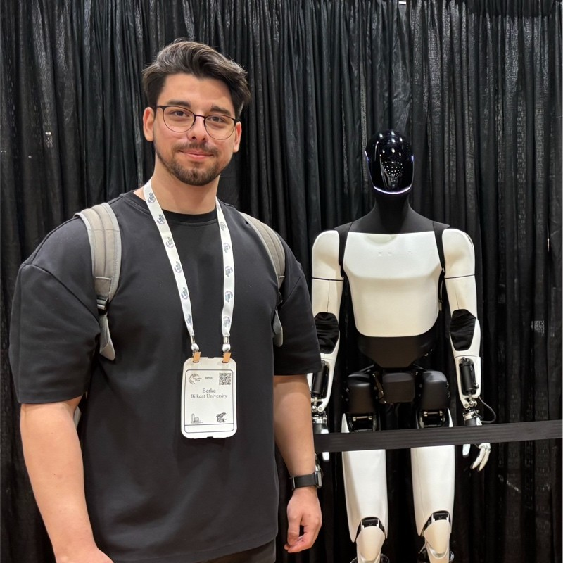

I am a Computer Science student at <a href="https://w3.bilkent.edu.tr/">Bilkent University</a>.

I'm looking for PhD or MSc opportunities.

## Research

My publications:

Dual Encoder GAN Inversion for High-Fidelity 3D Head Reconstruction from Single Images
**Ahmet Berke Gökmen^**, Bahri Batuhan Bilecen^, Ayşegül Dündar. _**NeurIPS2024**, Accepted poster._ [Project Page and Paper 🔗.](https://berkegokmen1.github.io/dual-enc-3d-gan-inv/)

Counterfactual Disease Removal and Generation in Chest X-Rays Using Diffusion Models
**Ahmet Berke Gökmen**, Ender Konukoğlu. In Submission.\_ [Project Page and Paper 🔗.](https://berkegokmen1.github.io/counterfactual-disease-removal-and-generation-chest-xray/)

Identity Preserving 3D Head Stylization with Multiview Score Distillation
Bahri Batuhan Bilecen, **Ahmet Berke Gökmen**, Furkan Güzelant, Ayşegül Dündar. _In Submission._ [Project Page and Paper 🔗.](https://three-bee.github.io/head_stylization/)
